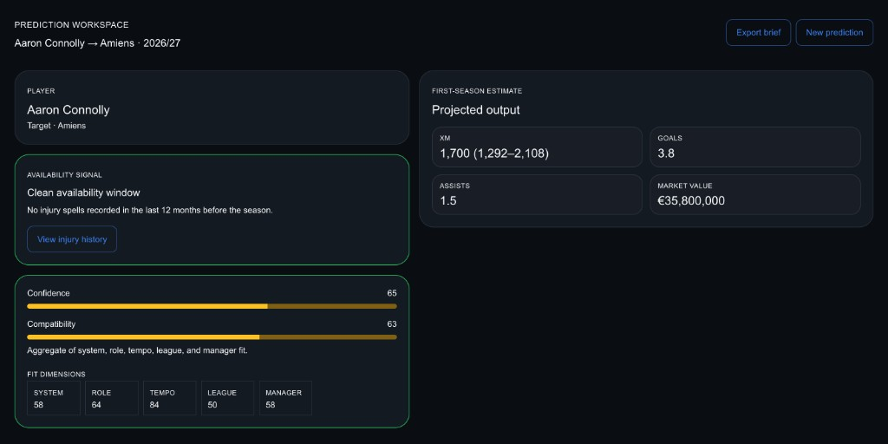
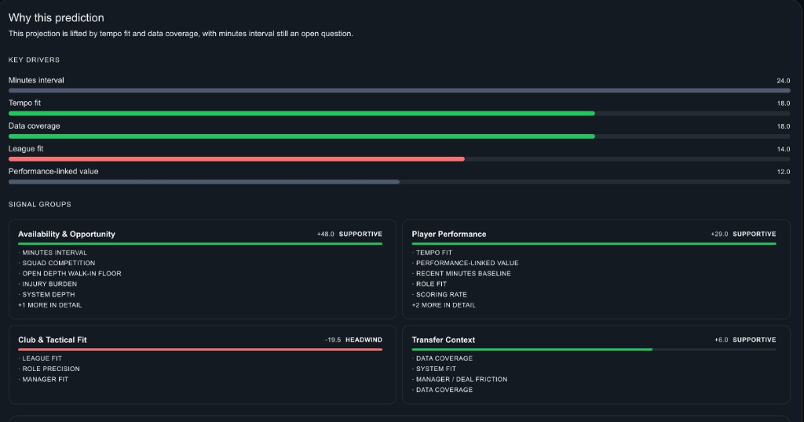
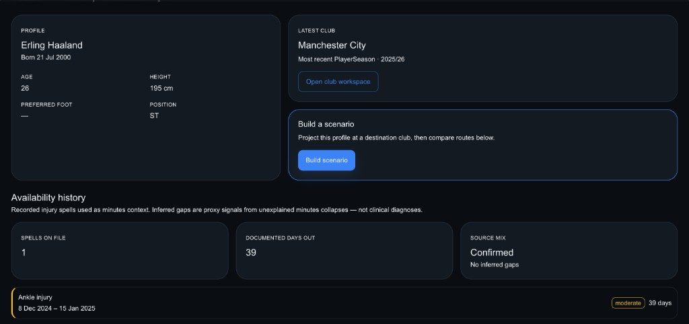

# Kleos Transfers

Open-source, explainable football transfer prediction — estimate how a player is likely to perform at a **specific club** in a **specific season**, with the contextual factors behind each projection.

**Live:** [kleos-transfer.vercel.app](https://kleos-transfer.vercel.app) · **API:** [kleos-transfers-api.onrender.com](https://kleos-transfers-api.onrender.com/api/v1/health)

Engine: **`v0.12-heuristic`** · Leagues: **top five** (ENG, ESP, GER, ITA, FRA) · Seasons: **2016/17–2025/26**

---

## How it works

1. **Pick a scenario** — player, destination club, and target season.
2. **Run the engine** — loads history, squad context, injuries, and transfers *as of season start* (no outcome leakage).
3. **Read the projection** — minutes, goals, assists, market value, compatibility/confidence, and factor-level explanations.

<p align="center">
  
</p>

Each result breaks down **why** the model landed where it did — key drivers plus grouped signals (availability, performance, tactical fit, transfer context):

<p align="center">
  
</p>

Player profiles feed injury and availability context into the minutes model:

<p align="center">
  
</p>

Completed-season backtests are published in [`research/validation/latest.json`](research/validation/latest.json) — see [`docs/prediction-validation.md`](docs/prediction-validation.md).

---

## Architecture

```text
FBref / Wikimedia / Wikipedia / enrichers
              │
              ▼
     PostgreSQL (Supabase)
              │
              ▼
   Spring Boot API (Render)  ←──  React SPA (Vercel)
              │
              ▼
   HeuristicPredictionEngine (v0.12)
   → minutes · outputs · compatibility · confidence · explanations
```

| Layer | Stack |
|-------|--------|
| **Frontend** | React 19, TypeScript, Vite, MUI, TanStack Query |
| **Backend** | Java 21, Spring Boot 3, JPA, Flyway, PostgreSQL |
| **Hosting** | Vercel + Render + Supabase (free tier) |

**Domain model** (three layers):

1. **Identity** — Player, Club, Manager, Season, Tournament
2. **Historical** — PlayerSeason, Transfer, Contract, Injury, …
3. **Prediction** — PredictionRun, Prediction, Explanation, Evaluation

Details: [`docs/domain-model.md`](docs/domain-model.md) · API reference: [`backend/README.md`](backend/README.md)

Production writes are restricted: public users can **read** and **`POST /predictions`**; bulk ingest requires `KLEOS_INGEST_API_KEY` (see [`docs/deployment.md`](docs/deployment.md)).

---

## Data sources

| Source | Used for |
|--------|----------|
| **FBref** (via `soccerdata`) | Clubs, players, seasons, player-season stats (primary ingest) |
| **Wikipedia / Wikidata** | Transfer windows, career leaders, player bio (height, foot) |
| **TheSportsDB / Wikimedia** | Club crests and player photos (hotlinked URLs only) |
| **Understat** (optional) | xG/xA backfill when FBref expected cols are missing |
| **Kleos-derived** | Transfers from season diffs; inferred contracts/injuries from minutes gaps |

**Coverage:** Premier League, La Liga, Bundesliga, Serie A, Ligue 1 — **2016/17 through 2025/26**. Forward seasons (e.g. 2026/27) exist as identity shells for simulation only.

We do **not** commit scraped dumps or republish raw provider data. Full policy: [`docs/data-sourcing.md`](docs/data-sourcing.md).

---

## Quick start

**Backend** (Java 21, PostgreSQL):

```bash
cd backend
cp ../.env.example ../.env   # DATABASE_*
./gradlew test && ./gradlew bootRun
# → http://localhost:8080/api/v1
```

**Frontend** (Node 20+):

```bash
cd frontend
cp .env.example .env.local   # VITE_API_BASE_URL=http://localhost:8080
npm install && npm run dev
# → http://localhost:5173
```

**Load data** (backend running):

```bash
pip install -r scripts/requirements-ingest.txt
./scripts/ingest_fbref_pl_laliga.py --dry-run --seasons 2024/25
```

More scripts and ingest options: [`scripts/README.md`](scripts/README.md) · Production deploy: [`docs/deployment.md`](docs/deployment.md) · Ops: [`docs/ops.md`](docs/ops.md)

---

## Repository

```text
backend/   Spring Boot API
frontend/  React web app
docs/      Architecture, deployment, data policy
research/  Validation artifacts and notes
scripts/   FBref ingest, enrichment, backtests
```

## Contributing

See [CONTRIBUTING.md](CONTRIBUTING.md).

## License

[MIT License](LICENSE)
